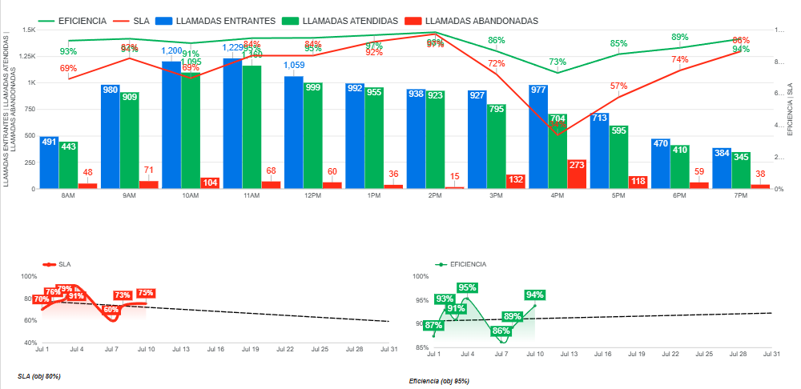
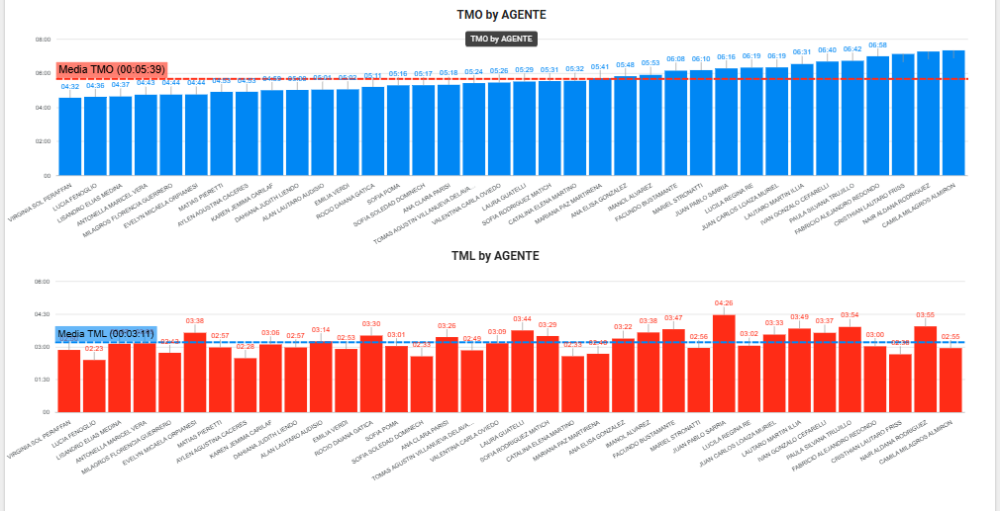
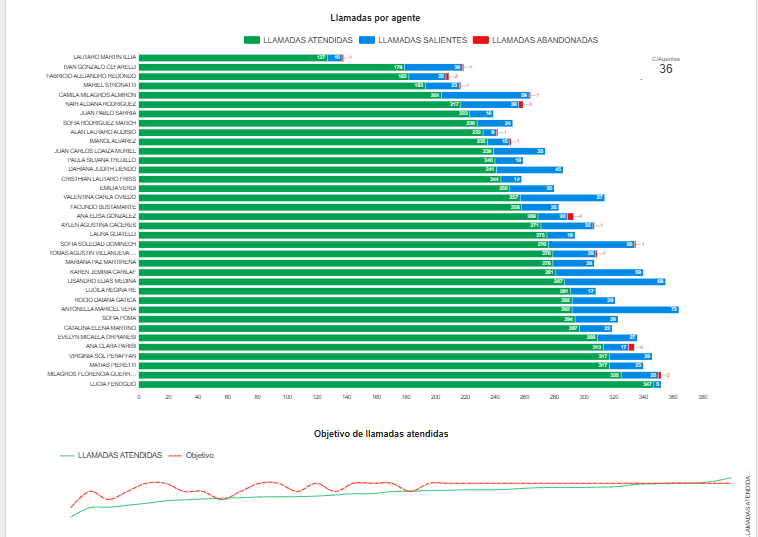
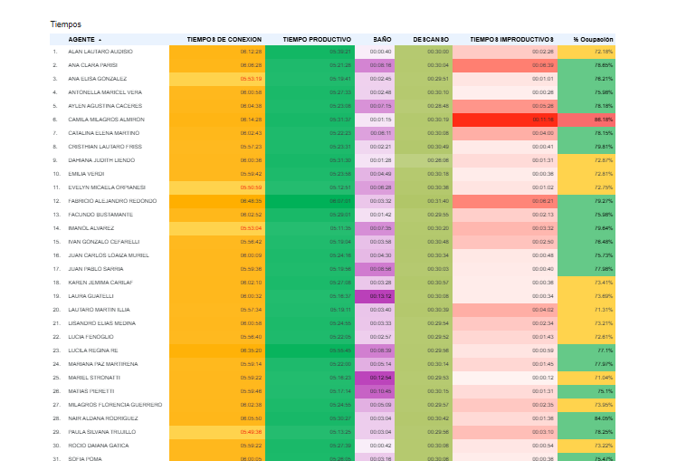
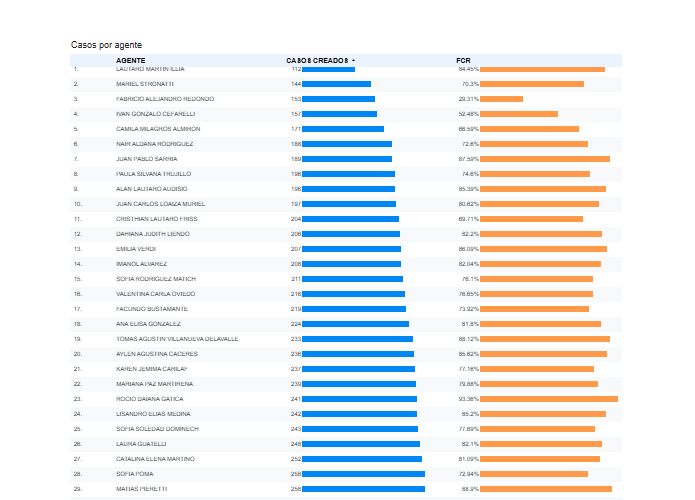

# Proyecto: Tablero Lideres 0810.
## Data
Se usan 6 archivos 3 generados en CISCO, los dos de pausas salen de qlikview y 1 de casos de salesforce
## CISCO
1.  `informe_entrantes` : -Contact Service Queue Activity Report by Interval
2.  `informe_detalle_agentes` : -Agent Detail Report
3.  `detalle_sistema` : -Detailed Call CSQ Agent Report
## QlikView
 Salen del tablero: estados en construccion - estados agente.
 **IMPORTANTE** Sale de una tabla de cisco el reporte que lo trae es : -Agent State Detail Report
 - `informe_pausas` 
 - `informe_estados`
## Salesforce
 Informe: Casos Reporte Customizado . Objeto de SF : Caso
 - `informe_casos`

Se compone de 5 scripts.py : todos se ejecutan desde la terminal, pasando la ruta de los archivos
como argumento:
```bash
python3 script.py "archivo1" "archivo2" "archivo3"
```
1. llamadas.py
2. tiempos.py
3. llamadas_agente.py
4. estados.py
5. cases.py

## llamadas.py 
- archivos que usa:
1.  `informe_entrantes`
2.  `informe_detalle_agentes`
3.  `detalle_sistema`

**Importante:** El script tiene dos pausas (`input()`). Después de generar y mostrar la primera tabla, el programa esperará a que presiones **Enter** para continuar y generar la segunda tabla. Esto se hizo para dar tiempo a copiar los datos del portapapeles

El script ejecuta dos funciones principales en secuencia:

### llamadas_total()
 . Organiza los kpis y el resumen del dia.
 **Importante** Los datos de llamadas_total() van en la hoja *LLAMADAS* , de la hoja de calculo usada como bdd. 

### tablero_llamadas()
. Generar una tabla detallada por hora con las principales métricas de llamadas entrantes.
**Importante** Los datos de llamadas_total() van en la hoja *RECIBIDAS-ATENDIDAS-ABANDONADAS* , de la hoja de calculo usada como bdd. 
- Los datos tienen esa distribución para poder armar el primer gráfico combinado que se vé en Looker.



## tiempos.py
- archivos que usa:
1.  `informe_detalle_agentes`
2.  `informe_pausas`

### tiempos()
* **Propósito:** Generar un resumen con los **tiempos promedio generales** del día para todo el equipo seleccionado.
* **Importante** Los datos van en la hoja *TIEMPOS*
- Los datos proporcionan el kpi diario de TMO y TML.
### tiempos_por_agente()

* **Propósito:** Generar una tabla detallada con el **TMO y TML individual para cada agente**.
* **Importante** Los datos van en la hoja *TIEMPOS_POR_AGENTE*


- Los datos se usan para generar estos dos gráficos.


## llamadas_agente.py
- archivos que usa:
    1. `informe_detalle_agentes`
    2. `detalle_sistema`

 - El script ejecuta una única función principal:

### llamadas_por_agente()
**Propósito**: Generar una tabla detallada que desglosa, por cada agente del equipo, la cantidad total de llamadas Entrantes, Salientes y Abandonadas que manejó.
**IMPORTANTE** 
Identifica las llamadas abandonadas en el detalle_sistema basándose en *una regla específica del negocio (tiempo de conversación nulo y tiempo de timbre de 12 segundos).*

**Importante**: Los datos de esta función van en la hoja ENTRANTES_SALIENTES_AGENTES, de la hoja de cálculo usada como bdd.

- Los datos se usan para el gráfico *Llamadas por agente* y *Objetivo de llamadas*
    -objetivo de +45 llamadas atendidas


##  estados.py
- archivos que usa:
    1. `informe_pausas`
    2. `informe_estados`

### take_time()
**Propósito**: Procesar los reportes de estados y pausas de los agentes para generar una tabla de productividad y ocupación para cada agente.

El script identifica automáticamente cuál de los dos archivos de entrada es el de 'pausas' y cuál el de 'estados'

Calcula un conjunto de métricas de productividad clave, como: Tiempo Productivo, Tiempo de Conexión, Tiempo Operativo, Tiempos Improductivos y el Porcentaje de Ocupación.

Importante: Los datos de esta función van en la hoja *ESTADOS*, de la hoja de cálculo usada como bdd.

- Los datos se usan para el cuadro:



## Cases.py
- archivo que usa
  1. `informe_casos`

### cases()
Propósito: Calcular la cantidad de casos creados y cerrados por cada agente a partir del reporte de Salesforce, y determinar su tasa de Resolución en el Primer Contacto (FCR - First Call Resolution).

Importante: Los datos de esta función van en la hoja *CASOS_USUARIO*, de la hoja de cálculo usada como bdd.

- Los datos se usan para el resumen de **casos creados** y la tabla *casos por agente*

